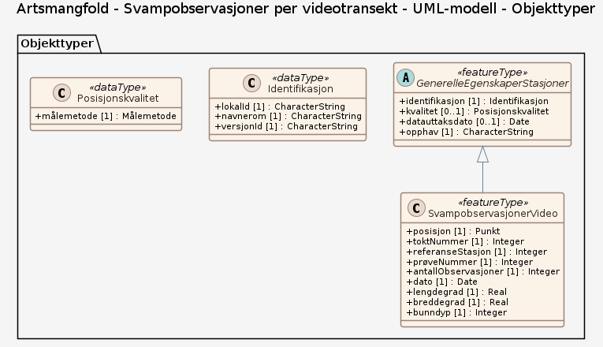

# Produktspesifikasjon: Artsmangfold – Svampobservasjoner per videotransekt

*Datasettet viser antall svampobservasjoner per video-transekt og er basert på observasjoner av videomateriale av overflaten av havbunnen, samlet inn ved hjelp av videorigg. Opptak av havbunnens overflate ble gjort langs 200 m og 700 m lange transekt. Hvert punktsymbol er plottet på koordinatene for transektets midtpunkt, hvor symbolets størrelse korresponderer med antall observasjoner.*

**Nøkkelord:** videotransekt, svamper, mareano, Norge digitalt, fellesDatakatalog, Natur, Kyst og fiskeri, SvampobservasjonerVideo, toktNummer, referanseStasjon, prøveNummer, antallObservasjoner, dato, lengdegrad, breddegrad, bunndyp

**Emnekategorier:** Biologisk mangfold

**Geografisk utstrekning**:

- **Vest**: 3.06
- **Øst**: 96.96
- **Sør**: 62.27
- **Nord**: 80.654113

**Geografisk område**:
Norske havområder.

**Tidsmessig utstrekning**:

- **Tidsperiode**:
  - **Fra**: 2021-06-04
  - **Til**: 2025-02-13

## Om spesifikasjonen

> **Denne versjonen av produktspesifikasjonen:**  
> **Opprettet dato:** 2021-06-04 
> **Endret dato:** 2025-02-13 
> **Språk:** nor 
> **Kontaktinformasjon:** Havforskningsinstituttet, [paal.mortensen@hi.no](mailto:paal.mortensen@hi.no)

## Om produktet Artsmangfold – Svampobservasjoner per videotransekt

> **Romlig representasjonstype:** Vektor 
> **Unik identifikator:** <https://data.geonorge.no/sosi/artsmangfold/artsmangfold_svampobservasjoner_video> 
> **Kontaktinformasjon:** Havforskningsinstituttet, [paal.mortensen@hi.no](mailto:paal.mortensen@hi.no)
>
> **Romlig oppløsning:**
>
> **Ekvivalent målestokk**: 500000
>
> **Begrensninger:**
>
> **Ressursbegrensninger**:
>
> - **Bruksbegrensninger**: Ingen begrensninger på bruk er oppgitt.
>
> **Juridiske begrensninger**:
>
> - **Tilgangsbegrensninger**: Åpne data
> - **Bruksbegrensninger**: Lisens
> - **Lisens**: Norsk lisens for offentlige data (NLOD)
> - **Lisenslenke**: <http://data.norge.no/nlod/no/1.0>
>
> **Sikkerhetsbegrensninger**:
>
> - **Klassifisering**: Ugradert

### Formål

Datasettet viser artsmangfoldet ved havbunnen. Det bør tas hensyn til dette artsmangfoldet i forbindelsen med planlegging av aktiviteter som kan føre til forstyrrelser av artsmangfoldet. Datasettet kan brukes som et verktøy for marin areal- og miljøplanlegging, sårbarhetsanalyser, habitatskartlegging og i forbindelse med installasjoner på havbunnen og aktiviteter som kan ha påvirkning på havbunnen. Videre kan datasettet brukes som beslutningsgrunnlag ved vurdering av nye oppdrettskonsesjoner, utslipp i sjø, deponering, utbygging av petroleumsrelaterte installasjoner, og regulering av fiskeriaktivitet.

## Omfang

### Hele datasettet

**Nivå**: dataset

**Nivåbeskrivelse**: Gjelder hele datasettet. Hvis omfang ikke er oppgitt under en overskrift, gjelder teksten for hele datasettet og alle leveranser

### UML-modell

**Nivå**: dataset

## Datainnhold og struktur

### Datamodell - UML-modell

➡️ [Se full datamodell for omfang "UML-modell" (diagram per pakke og objektkatalog)](uml-modell/objektkatalog.html)

## Referansesystem

| EPSG-kode | Navn på referansesystem |
| --- | --- |
| [EPSG:25833](https://epsg.io/25833) | [EUREF89 UTM sone 33, 2d](https://register.geonorge.no/epsg-koder) |
| [EPSG:3035](https://epsg.io/3035) | [EUREF89 / ETRS89-LAEA Europe](https://register.geonorge.no/epsg-koder) |
| [EPSG:4258](https://epsg.io/4258) | [EUREF 89 Geografisk (ETRS 89) 2d](https://register.geonorge.no/epsg-koder) |

## Datakvalitet

**Nivå**: dataset

**Kvalitetsmål**: SOSI produktspesifikasjon: Artsmangfold - Svampobservasjoner per videotransekt

- **Beskrivende resultat**: Dataene er i henhold til produktspesifikasjonen

**Kvalitetsmål**: Sosi applikasjonsskjema

- **Beskrivende resultat**: SOSI-filer er i henhold til applikasjonsskjema

**Kvalitetsmål**: Sosi applikasjonsskjema

- **Beskrivende resultat**: GML-filer er i henhold til applikasjonsskjema

**Kvalitetsmål**: Prosentvis oppfyllelse av FAIR-prinsipper

- **Målebeskrivelse**: Angir fullstendighet i forhold til krav fra FAIR-prinsippene (The FAIR Guiding Principles for scientific data management and stewardship)
- **Resultat**: 98

## Datafangst og produksjon

Datasettet viser observasjoner fra videorigg i de områder som MAREANO har kartlagt. Datasettet er ikke heldekkende. Dekningsgrad avhenger av hvilken kartleggingsinnsats som er lagt ned innenfor de forskjellige områdene. Datasettet egner seg til bruk i målestokk 500 000 - 10 000 000.

## Vedlikehold

**Vedlikeholdsfrekvens**: Årlig

**Status**: Fullført

## Presentasjon

**navn**: Tegneregler

**Lenke**:
<https://register.geonorge.no/register/versjoner/tegneregler/havforskningsinstituttet/artsmangfold-svampobservasjoner-per-video-transekt>

## Leveranse

| Tjeneste | Endepunkt | Type | Format | Leveranseenheter |
| --- | --- | --- | --- | --- |
| Geonorge nedlastning | [Lenke](https://nedlasting.geonorge.no/api/capabilities/0d1bf03d-f3fa-4ba5-bbff-52543f3d066d) | GEONORGE:DOWNLOAD | FGDB, GML, PostGIS, SOSI | landsfiler |
| Atom Feed | [Lenke](http://nedlasting.geonorge.no/geonorge/ATOM-feeds/ArtsmangfoldSvampObsVideo_AtomFeedFGDB.xml) | W3C:AtomFeed | FGDB | landsfiler |
| Atom Feed | [Lenke](http://nedlasting.geonorge.no/geonorge/ATOM-feeds/ArtsmangfoldSvampObsVideo_AtomFeedGML.xml) | W3C:AtomFeed | GML | landsfiler |
| Atom Feed | [Lenke](http://nedlasting.geonorge.no/geonorge/ATOM-feeds/ArtsmangfoldSvampObsVideo_AtomFeedPOSTGIS.xml) | W3C:AtomFeed | PostGIS | landsfiler |
| Atom Feed | [Lenke](http://nedlasting.geonorge.no/geonorge/ATOM-feeds/ArtsmangfoldSvampObsVideo_AtomFeedSOSI.xml) | W3C:AtomFeed | SOSI | landsfiler |
| Artsmangfold – Svampobservasjoner per videotransekt WMS | [Lenke](https://kart.hi.no/mareano/mareano_biologi/svamper_video/wms?service=WMS&request=GetCapabilities) | WMS-tjeneste | PNG |  |
| GeoPackage: uml-modell | [Lenke](https://raw.githubusercontent.com/ToreFreddyB/produktspesifikasjon_HI/main/produktspesifikasjon/artsmangfold-svampobservasjoner-per-videotransekt/uml-modell/uml-modell.gpkg) | Nedlasting | GPKG |  |

## Metadata

**Metadatastandard**: ISO19115

**Metadatastandardversjon**: 2003

**Metadatadato**: 2026-10-07

**språk**: nor

**Kontakt**:

- **Organisasjon**: Havforskningsinstituttet
- **Kontaktperson**: Kjell Bakkeplass
- **Logo**: <https://register.geonorge.no/data/organizations/971349077_hi_liten.png>
- **Epost**: kjell.bakkeplass@hi.no
- **rolle**: pointOfContact

**Metadataidentifikator**:

- **Utsteder**: Geonorge
- **kode**: 0d1bf03d-f3fa-4ba5-bbff-52543f3d066d
- **koderom**: <https://kartkatalog.geonorge.no/metadata/>
- **Metadatalenke**: <https://kartkatalog.geonorge.no/metadata/0d1bf03d-f3fa-4ba5-bbff-52543f3d066d>

## Tilleggsinformasjon

- **Produktark:** [https://register.geonorge.no/register/versjoner/produktark/havforskningsinstituttet/artsmangfold-svampobservasjoner-per-videotransekt](https://register.geonorge.no/register/versjoner/produktark/havforskningsinstituttet/artsmangfold-svampobservasjoner-per-videotransekt)
- **Produktside:** [https://www.mareano.no](https://www.mareano.no)
