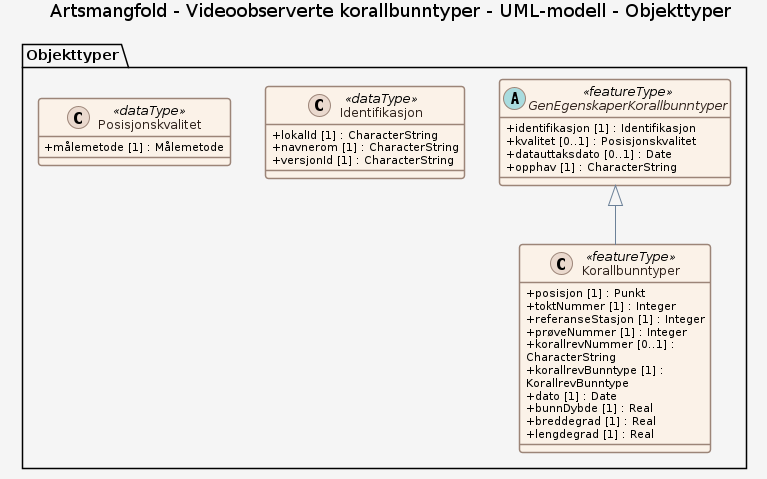

# Produktspesifikasjon: Artsmangfold - Videoobserverte korallbunntyper

*Datasettet viser observasjoner av ulike korallbunntyper (Levende Lophelia, Korallrester og Død Lophelia) som er loggført i felt under videoundersøkelse av havbunnen. Korallrester er små skjellett-fragmenter (< 20 cm) av døde Lophelia koraller, mens Død Lophelia er større (>20 cm) fragmenter av døde korallskjelletter. Levende Lophelia er kolonier av levende Lophelia, med ulik størrelse. Sammen med havbunnstopografien gir disse observasjonene en indikasjon på utstrekningen av korallrevene lokalt.
Datasettet viser også videotransekt der det ikke er observert noen av disse koralbunntypene.*

**Nøkkelord:** videotransekt, observasjonsdata, koraller, Mareano, Norge digitalt, fellesDatakatalog, Kyst og fiskeri, Natur, Korallbunntyper, toktNummer, referanseStasjon, prøveNummer, korallrevNummer, korallrevBunntype, dato, bunnDybde

**Emnekategorier:** Biologisk mangfold

**Geografisk utstrekning**:

- **Vest**: 3.0
- **Øst**: 37.0
- **Sør**: 62.0
- **Nord**: 81.0

**Tidsmessig utstrekning**:

- **Tidsperiode**:
  - **Fra**: 2021-02-04
  - **Til**: 2025-02-11

## Om spesifikasjonen

> **Denne versjonen av produktspesifikasjonen:**  
> **Opprettet dato:** 2021-02-04 
> **Endret dato:** 2025-02-11 
> **Språk:** nor 
> **Kontaktinformasjon:** Havforskningsinstituttet, [paal.mortensen@hi.no](mailto:paal.mortensen@hi.no)

## Om produktet Artsmangfold - Videoobserverte korallbunntyper

> **Romlig representasjonstype:** Vektor 
> **Unik identifikator:** <https://data.geonorge.no/sosi/artsmangfold/artsmangfold_video-observerte_korallbunntyper> 
> **Kontaktinformasjon:** Havforskningsinstituttet, [paal.mortensen@hi.no](mailto:paal.mortensen@hi.no)
>
> **Romlig oppløsning:**
>
> **Ekvivalent målestokk**: 500000
>
> **Begrensninger:**
>
> **Ressursbegrensninger**:
>
> - **Bruksbegrensninger**: Ingen begrensninger på bruk er oppgitt.
>
> **Juridiske begrensninger**:
>
> - **Tilgangsbegrensninger**: Åpne data
> - **Bruksbegrensninger**: Lisens
> - **Lisens**: Norsk lisens for offentlige data (NLOD)
> - **Lisenslenke**: <http://data.norge.no/nlod/no/1.0>
>
> **Sikkerhetsbegrensninger**:
>
> - **Klassifisering**: Ugradert

### Formål

Datasettet gir en indikasjon (sammen med havbunnstopografi) på utstrekning av korallrev lokalt.

### Bruksområde

Datasettet kan brukes som et verktøy for marin areal- og miljøplanlegging, sårbarhetsanalyser, habitatskartlegging og i forbindelse med installasjoner på havbunnen og aktiviteter som kan ha påvirkning på havbunnen. Videre kan datasettet brukes som beslutningsgrunnlag ved vurdering av nye oppdrettskonsesjoner, utslipp i sjø, deponering, utbygging av petroleumsrelaterte installasjoner, og regulering av fiskeriaktivitet.

## Omfang

### Hele datasettet

**Nivå**: dataset

**Nivåbeskrivelse**: Gjelder hele datasettet. Hvis omfang ikke er oppgitt under en overskrift, gjelder teksten for hele datasettet og alle leveranser

### UML-modell

**Nivå**: dataset

## Datainnhold og struktur

### Datamodell - UML-modell

➡️ [Se full datamodell for omfang "UML-modell" (diagram per pakke og objektkatalog)](uml-modell/objektkatalog.html)

## Referansesystem

| EPSG-kode | Navn på referansesystem |
| --- | --- |
| [EPSG:25833](https://epsg.io/25833) | [EUREF89 UTM sone 33, 2d](https://register.geonorge.no/epsg-koder) |
| [EPSG:3035](https://epsg.io/3035) | [EUREF89 / ETRS89-LAEA Europe](https://register.geonorge.no/epsg-koder) |
| [EPSG:4258](https://epsg.io/4258) | [EUREF 89 Geografisk (ETRS 89) 2d](https://register.geonorge.no/epsg-koder) |

## Datakvalitet

**Nivå**: dataset

**Kvalitetsmål**: SOSI produktspesifikasjon: Artsmangfold video-observerte Korallbunntyper

- **Beskrivende resultat**: Dataene er i henhold til produktspesifikasjonen

**Kvalitetsmål**: Sosi applikasjonsskjema

- **Beskrivende resultat**: SOSI-filer er i henhold til applikasjonsskjema

**Kvalitetsmål**: Sosi applikasjonsskjema

- **Beskrivende resultat**: GML-filer er i henhold til applikasjonsskjema

**Kvalitetsmål**: Prosentvis oppfyllelse av FAIR-prinsipper

- **Målebeskrivelse**: Angir fullstendighet i forhold til krav fra FAIR-prinsippene (The FAIR Guiding Principles for scientific data management and stewardship)
- **Resultat**: 98

## Datafangst og produksjon

**Datainnsamling og prosessering**:

- **Prosesstrinn**:
  - **Beskrivelse**: Datasettet dekker de områder som MAREANO har kartlagt. Datasettet er ikke heldekkende. Dekningsgrad avhenger av hvilken kartleggingsinnsats som er lagt ned innenfor de forskjellige områdene. (Utstrekningsbeskrivelse: Norske havområder nord for 62. breddegrad.). Observasjoner av ulike korallbunntyper (Levende Lophelia, Korallrester og Død Lophelia) er loggført i felt under videoundersøkelse av havbunnen. Datasettet egner seg til bruk i målestokk 500 000 - 10 000 000.

## Vedlikehold

**Vedlikeholdsfrekvens**: Årlig

**Status**: Fullført

## Presentasjon

**navn**: Tegneregler

**Lenke**:
<https://register.geonorge.no/register/versjoner/tegneregler/havforskningsinstituttet/artsmangfold-videoobserverte-korallbunntyper>

## Leveranse

| Tjeneste | Endepunkt | Type | Format | Leveranseenheter |
| --- | --- | --- | --- | --- |
| Geonorge nedlastning | [Lenke](https://nedlasting.geonorge.no/api/capabilities/) | GEONORGE:DOWNLOAD | FGDB, GML, PostGIS, SOSI | landsfiler |
| Atom Feed | [Lenke](http://nedlasting.geonorge.no/geonorge/ATOM-feeds/VideoObsKorallbunntyper_AtomFeedFGDB.xml) | W3C:AtomFeed | FGDB | landsfiler |
| Atom Feed | [Lenke](http://nedlasting.geonorge.no/geonorge/ATOM-feeds/VideoObsKorallbunntyper_AtomFeedGML.xml) | W3C:AtomFeed | GML | landsfiler |
| Atom Feed | [Lenke](http://nedlasting.geonorge.no/geonorge/ATOM-feeds/VideoObsKorallbunntyper_AtomFeedPOSTGIS.xml) | W3C:AtomFeed | PostGIS | landsfiler |
| Atom Feed | [Lenke](http://nedlasting.geonorge.no/geonorge/ATOM-feeds/VideoObsKorallbunntyper_AtomFeedSOSI.xml) | W3C:AtomFeed | SOSI | landsfiler |
| Artsmangfold - Videoobserverte korallbunntyper WMS | [Lenke](https://kart.hi.no/mareano/mareano_biologi/korallobservasjoner_video/wms?service=WMS&request=GetCapabilities) | WMS-tjeneste | PNG |  |
| GeoPackage: uml-modell | [Lenke](https://raw.githubusercontent.com/ToreFreddyB/produktspesifikasjon_HI/main/produktspesifikasjon/artsmangfold-videoobserverte-korallbunntyper/uml-modell/uml-modell.gpkg) | Nedlasting | GPKG |  |

## Metadata

**Metadatastandard**: ISO19115

**Metadatastandardversjon**: 2003

**Metadatadato**: 2026-09-15

**språk**: nor

**Kontakt**:

- **Organisasjon**: Havforskningsinstituttet
- **Kontaktperson**: Kjell Bakkeplass
- **Logo**: <https://register.geonorge.no/data/organizations/971349077_hi_liten.png>
- **Epost**: kjell.bakkeplass@hi.no
- **rolle**: pointOfContact

**Metadataidentifikator**:

- **Utsteder**: Geonorge
- **kode**: 851bfa1c-c48a-42a2-83c6-11a4662b6d1d
- **koderom**: <https://kartkatalog.geonorge.no/metadata/>
- **Metadatalenke**: <https://kartkatalog.geonorge.no/metadata/851bfa1c-c48a-42a2-83c6-11a4662b6d1d>

## Tilleggsinformasjon

- **Produktark:** [https://register.geonorge.no/register/versjoner/produktark/havforskningsinstituttet/artsmangfold-videoobserverte-korallbunntyper](https://register.geonorge.no/register/versjoner/produktark/havforskningsinstituttet/artsmangfold-videoobserverte-korallbunntyper)
- **Produktside:** [https://www.mareano.no](https://www.mareano.no)
